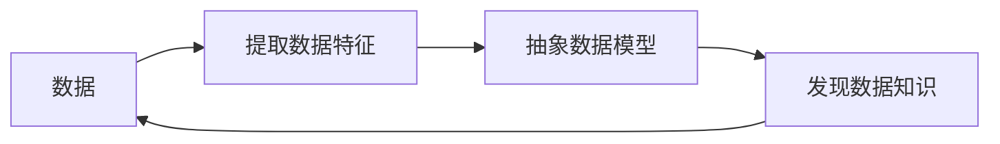
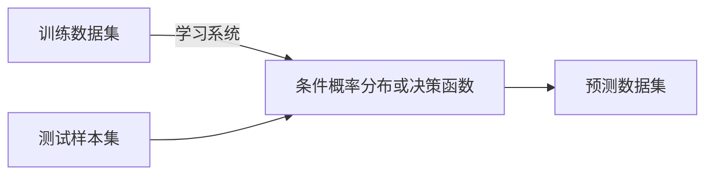
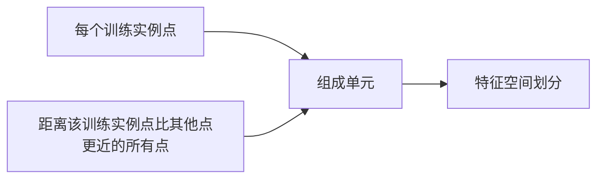

[TOC]

# 前言

为了学习机器学习，开始自研统计学习方法，本来我是对这个学科只停留在简单的高等数学的基础，仅仅认为是简单的数据归纳问题，但是随着我看机器学习的相关课程，越到后面的课程越懵，才发现之前学习的那点知识完全不够，想自己研究一下具体内容。本学习过程主要参考教材李航老师《统计学习方法》，间接地去辅助学习正在看的吴恩达老师的《机器学习课程》，希望能有所收获。

# 统计学习概要

参考教材[**李航老师《统计学习方法》**](https://pan.baidu.com/s/1C1dLdM512TyZoNRcLvI8Kw),提取码：1218

## 统计学习

<strong>统计学习</strong>，英文:statistical learning,是计算机基于书籍构建概率统计模型并运用数据进行预测与分析的一门学科。

### 特点

> 系统通过执行某个过程来改进他的性能

### 对象

> 统计学习关于数据的<strong>基本假设</strong>: 同类数据具有一定的<strong> 统计规律</strong>

### 目的

统计学习用于**对数据进行预测与分析**，而主要是通过构建**概率统计模型**实现的，因而学习的总目标就是**考虑学习什么样的模型和如何学习模型**。

### 方法

已知的统计学习方法有：

- **监督学习**
- **非监督学习**
- **半监督学习**
- **强化学习**

> 监督学习
>
> > 1. 基于**给定的**、**有限的**、**用于学习**的训练数据集合出发
> > 2. 数据假设是**独立同分布**形成的
> > 3. 模型假设是属于**某个函数的集合**，称为假设空间
> > 4. 应用某个**评价准则**，从假设空间中选取一个最优的模型，使它对已知训练数据和未知数据在评价准则下有**最优的预测**
> > 5. 最优模型的选取由算法实现

统计学习方法三要素：

- **模型**（model）
- **策略**（strategy）
- **算法**（algorithm）

实现统计学习方法的步骤：

### 研究

统计学习研究一般包括：

> **统计学习方法**：旨在开发新的学习方法

> **统计学习理论**：探求学习方法的有效性与效率，以及统计学习基本理论问题

> **统计学习应用**：将学习方法应用到实际问题中个，解决实际问题。

## 监督学习

### 基本概念

**输入空间**：输入变量取值的集合,输入变量用大写字母表示，习惯上输入变量写作$X$，变量取值写作$x$,实例$x$的特征向量记作：
$$
x=(x^{(1)},x^{(2)},\cdots,x^{(n)})^{T}
$$
注意:$x^{(i)}$表示第$i$个特征变量，$x_{i}$表示多输入变组量的第$i$组

> > **特征空间**：每个具体输入的实例，通常由特征向量表示，所有变量存在的空间称为特征空间

**输出空间**：输出变量取值的集合，输出变量用大写字母表示。习惯上输出变量写作$Y$，变量取值写作$y$

**训练集**表示：
$$
T={((x_{1},y_{1}),(x_{2},y_{2}),\cdots,(x_{N},y_{N}))}
$$

> 输出变量$X$和输入变量$Y$类型不同，预测任务对应的名称不同
>
> > **回归问题**：输出变量和输出变量均为连续变量
> >
> > **分类问题**：输出变量为离散变量
> >
> > **标注问题**：输入变量与输出变量均为变量序列

**联合概率分布**

> - 理论上假设，输入和输出的随机变量都应遵循联合概率分布$P(X,Y)$
>
> - 对于学习过程，该分布是**未知**，但是我们假定是**存在**的
> - 假定每个训练数据都是依据概率分布$P(X,Y)$生成的，且都是**独立同分布的**

### 问题形式化

监督学习分为**学习**和**预测**两个过程，因训练集往往由人工给出，所以称为**监督学习**

## 统计学习三要素

统计学习方法三要素：**模型**、**策略**和**算法**

### 模型

> > **监督学习**中，**模型**就是要学习的**条件概率分布**或**决策函数**，**假设空间**包括了所有这些分布或函数。

假设空间用$F$表示，假设空间可以定义为决策函数的集合
$$
F=\{f|Y=f(X)\}
$$
其中，$F$通常是由一个参数向量决定的函数族：
$$
F=\{f|Y=f_{\theta},\theta \in R^n\}
$$
其中，参数向量$\theta$取值于$n$维欧式空间$R^n$，称为参数空间。

或者假设空间定义为条件概率的集合：
$$
F=\{{P|P(Y|X)}\}
$$
同理，$F$也可以是一个参数向量决定的条件概率分布族:
$$
F=\{{P|P_{\theta}(Y|X),\theta \in R^n}\}
$$

### 策略

有了假设空间，统计学习接下来的工作就是考虑按照什么样的**准则学习**或选择**最优的模型**

评价模型的工具:

> > **损失函数**（也称**代价函数**）：度量模型一次预测的好坏
> >
> > **风险函数**：度量平均意义下模型预测的好坏

**损失函数**

对于给定的输入$X$经$f(X)$的输出$Y$,输出值与真实值之间可能存在不一致，因而引入损失函数来度量错误的程度，记作$L(Y,f(X))$

几种比较常见的损失函数

函数名|形式
--|--
**$0-1$**损失函数|$L(Y,f(x))=\begin{cases} 1, &\mbox{Y$\neq$f(X)}\\0, &\mbox{Y =  f(X)} \end{cases}$
**平方**损失函数|$L(Y,f(X))=(Y-f(X))^2$
**绝对**损失函数|$L(Y,f(X))=|Y-f(X)|$
**对数**损失函数|$L(Y,P(Y|X))=-logP(Y|X)$

**损失函数值越小，模型越好**。

一般都是应用损失函数的**期望**来选择**风险小**的模型

> 理论上，损失函数的期望：
> $$
> R_{exp}(f)=E_p[L(Y,f(X))]=\int_{x{\times}y}L(y,f(x))P(x,y),dxdy
> $$

但是$P_{exp}(X,Y)$是未知的，其$R_{exp}(f)$是无法得到的。

当想通过**大数定律**，在给定一个数量比较大的训练集，用模型的**平均损失**（也称**经验风险**或者**经验损失**）来趋于**期望风险**：
$$
训练数据集：T=\{{(x_1,y_1),(x_2,y_2),\cdots,(x_N,y_N)}\}
$$

$$
经验损失：R_{emp}(f)=\frac{1}{N}\sum^N_{i=1}{L(y_i,f(x_i))}
$$

但是，现实中训练样本数目很小，这样的做法并不理想。

**经验风险最小化与结构风险最小化**

> > **经验风险最小化**：在假设空间、损失函数以及训练数据集确认的情况下，**经验风险函数**就可以确定，经验风险最小化的策略认为，经验风险最小的模型是最优的模型。

但是，样本容量很小时，经验风险最小化学习的效果就可能出现“**过拟合**”现象

> > 结构风险最小化是为了防止过拟合而提出的策略

> > **结构风险最小化**：等价于正则化，结构风险在经验风险上加上表示模型复杂度的**正则化项**或**罚项**。

结构风险定义：
$$
R_{srm}(f)=\frac{1}{N}\sum^N_{i=1}{L(y_i,f(x_i))+ \lambda J(f) }
$$
其中，$J(f)$为模型的复杂度，是定义在假设空间$F$上的泛函，模型越复杂，复杂度越大，表示对模型的“惩罚"。

> > 结构风险小必须要求经验风险和复杂度都要小，这样对训练数据和未知数据的测试都有较好的效果

因而监督学习就变成了需求最小化的结构风险函数。
$$
\underset{f \in F}{min}\frac{1}{N}\sum^N_{i=1}{L(y_i,f(x_i))+ \lambda J(f) }
$$

### 算法

实现学习模型的具体计算方法

## 模型评估与模型选择

### 训练误差与测试误差

> > 当损失函数给定时，基于损失函数的模型的训练误差和测试误差就是学习方法评估的标准

**注意**: 统计学习方法使用的损失函数不一定是评估函数时使用的损失函数

> > 通常将学习方法对未知数据的预测能力称为**泛化能力**

### 过拟合与模型选择

如果假设空间中存在“真”模型，那选择的模型必须要接近真模型，其参数数量应该也应该与其相同。

但是我们为了让模型和训练数据很贴合，增大了参数数量，一般超过了真模型，导致选择的模型和训练数据贴合，与测试数据预测很差，这就是**过拟合**

**注意**：实际选择的时候一定要注意过拟合问题。

## 正则化与交叉验证

### 正则化

**正则化**就是前面部分提到的给经验风险上加一个正则化项或罚项,该项随着模型的复杂度的增加增加

正则化的一般形式：
$$
\underset{f \in F}{min} \frac{1}{N} \sum^N_{i=1}{L(y_i,f(x_i))+\lambda J(f)}
$$

> > 正则化的目的是为了选择那些能够很好解释已知数据并简单的模型
> >
> > 从**贝叶斯估计**的角度解释就是简单的模型具有较小的先验概率

### 交叉验证

如果**给定的样本数据充足**，随机将数据集切分成三个部分：**训练集**、**验证集**和**测试集**

> > **训练集**：用来训练模型
> >
> > **验证集**：用于模型的选择
> >
> > **测试集**：用于对学习方法的评估

但实际上很多情况，数据都是不够的，因而可以采用交叉验证，重复地将数据分成训练集和测试集，不断地反复地进行训练、测试以及模型选择。

|   交叉验证类别    |                             内容                             |
| :---------------: | :----------------------------------------------------------: |
| **简单**交叉验证  | 将已知数据分成训练集和测试集；基于**训练集**在各种条件下训练模型，得到不同的模型；基于测试集评价各个模型的测试误差，选出测试误差最小的模型 |
| **$S$折**交叉验证 | 将已知数据数据随机切成$S$个互不相交的大小相同的子集；用$S-1$个子集训练模型，用余下的子集测试模型；将这一过程的$S$种可能重复进行；最后选择$S$次评测中平均测试误差最小的模型 |
| **留一**交叉验证  |  $S$折交叉验证的特殊情况：$S=N$;其中，$N$是给定数据集的容量  |

## 泛化能力

### 泛化误差

> 学习方法的**泛化能力**：由该方法学习到的模型对未知数据的预测能力

泛化误差定义：
$$
R_{exp}(\hat{f})=E_P[L(Y,\hat{f}(X))]=\int_{x\times y}{L(y,\hat{f}(x))P(x,y)dxdy}
$$
其中，$\hat{f}$是学到的模型，选择最小泛化误差的模型

### 泛化误差上界

> 学习方法的泛化能力分析是通过研究泛化误差的**概率上界**进行的，通过比较两种学习方法的泛化误差上界的大小来进行

泛化误差上界的性质：

- 它是样本容量的函数；当样本容量增加，泛化上界趋于0
- 它是假设空间容量的函数；当假设空间容量越大，模型越难学，泛化误差上界就越大

> 定理：泛化误差上界
>
> > 对二类分类问题，当假设空间是有限个函数的集合$f=\{f_1,f_2,\dots,f_d\}$时，对任意一个函数$f \in F$,至少以概率$1-\delta$，以下不等式成立：
> > $$
> > R(f)\leqslant \hat{R}(f)+\varepsilon (d,N,\delta)
> > $$
> > 其中，$\varepsilon(d,N,\delta)=\sqrt {\frac{1}{2N}(\log{d}+\log{\frac{1}{\delta}})}$

不等式特点：

- $R(f)$是泛化误差，右端是泛化误差上界。
- $\hat{R}(f)$是训练误差，训练误差越小，泛化误差也越小。
- $\varepsilon (d,N,\delta)$是$N$(训练样本数)的单调递减函数，当$N$趋于无穷趋于0；同时也是$d$（假设空间中的模型数量）的单调递函增数。

## 生成模型与判别模型

监督学习的任务：学习一个模型，应用这一个模型。对给定的输入预测相应的输出。

> 模模型的一般形式：
>
> > 决策函数： $Y=f(X)$
> >
> > 条件概率分布： $P(Y|X)$

| 监督学习方法 |   模型   |                         模型生成过程                         |                         典型模型代表                         |                             特点                             |
| :----------: | :------: | :----------------------------------------------------------: | :----------------------------------------------------------: | :----------------------------------------------------------: |
|   生成方法   | 生成模型 | 学习方法先由数据学习联合概率分布$P(X,Y)$,然后求出条件概率分布$P(Y|X)$，作为预测模型，即生成模型：$P(Y|X)=\frac{P(X,Y)}{P(X)}$ |                 朴素贝叶斯法、隐马尔可夫模型                 | 可以还原联合概率分布$P(X,Y)$,判别方法不行；学习收敛速度更快，随着样本容量增加，模型更快收敛与真实模型；当存在隐变量时，仍可以用生成方法学习，但判别方法不行 |
|   判别方法   | 判别模型 | 数据直接学习决策函数$f(X)$或者条件概率分布$P(Y|X)$作为预测的模型； | $k$近邻法、感知机、决策树、逻辑树、逻辑斯谛回归模型、最大熵模型、支持向量机、提升方法和条件随机场 | 直接学习的是条件概率$P(Y|X)$或决策函数$f(X)$，直接面对预测，往往学习的准确率更高；可以对数据进行各种程度上的抽象、定义特征并使用特征，因此可以简化学习问题 |

## 分类问题

在监督问题中，当输出变量$Y$取有限个离散值时，预测问题变成分类问题。

**分类器**：监督学习从数据中学习一个分类模型或分类决策函数。

**分类**：分类器从新的输入进行输出的预测。

**类**：可能的输出

> 分类问题包括学习和分类两个过程
>
> > 学习：根据已知的训练数据集利用有效的学习方法爱学习一个分类器
> >
> > 分类：利用学习的分类器对新的输入实例进行分类

**评价分类器性能的指标一般是分类准确率**

> 分类准确率：对于**给定**的测试数据集，分类器正确分类的样本数与总样本数之比

对于二类分类问题常用的评价指标：精确度和召回率。通常以关注的类为正类，其他类为负类。

$TP$：将正类预测为正类数；

$FN$：将正类预测为负类数；

$FP$：将负类预测为正类数；

$TN$：将负类预测为负类数。

> 精确率：
> $$
> P=\frac {TP}{TP+FP}
> $$
> 召回率：
> $$
> R=\frac{TP}{TP+FN}
> $$
> $F_1$:精确率和召回率的调和值：
> $$
> \frac{2}{F_1}=\frac{1}{P}+\frac{1}{R}
> $$

使用分类问题的统计学习方法：$k$近邻法、感知机、朴素贝叶斯法、、决策树、决策列表、逻辑斯谛回归模型、支持向量机、提升方法、贝叶斯网络、神经网络、Winnow。

## 标注问题

**标注问题**属于**分类问题**的一个推广。

> 标注问题的输入是一个**观测序列**，输出是一个**标记序列**或**状态序列**

标注问题分为**学习**和**标注**两个过程

标注模型的指标和评价分类模型的指标一样。

使用标注问题的常用的统计学习方法：隐马尔可夫模型、条件随机场。

## 回归问题

回归用于预测输入变量（自变量）和输出变量（因变量）之间的关系。

回归模型正是表示从输入变量到输出变量之间映射的函数。

回归问题按照输入变量的个数，分为一元回归和多元回归；按照输入变量与输出变量之间关系的类型，分为线性回归和非线性回归。

# 感知机

> **感知机**定义：
>
> - **二类分类**的**线性分类**模型,其输入为**实例**的特征向量，输出为**实例**的类别，取$+1$和$-1$二值；
> - 将输入空间（特征空间）中的实例划分为正负两类的分离超平面，属于**判别模型**

## 感知机模型

**定义**：

> 假设输入空间（特征空间）是$X \subseteq R^n$,输出空间是$Y=\{+1,-1\}$。输入$x \in X$表示实例的特征向量，对应于输入空间（特征空间）的点；输出$y\in Y$表示实例的类别。

函数表示：
$$
f(x)=sign(w \cdot x + b)
$$
**感知机**，其中，$w$和$b$为感知机模型参数，$w \in R^n$叫作权值或者权值向量，$b \in R$ 叫作偏置，$sign$是符号函数。
$$
sign(x)=\begin{cases} +1,&{x \geqslant 0}\\-1,&{x<0} \end{cases}
$$

> 感知机的假设空间是定义在特征空间中的所有线性分类模型或线性分类器，即函数集合$\{f|f(x)=w \cdot x+ b\}$。

对于感知机的几何解释：线性方程 $w \cdot x + b = 0$，对应于特征空间$R^n$中的一个超平面$S$。超平面将特征空间划分为两个部分，位于两部分的点（特征向量）分别被分为正、负两类。因此超平面$S$称为分离超平面。

## 感知机学习策略

### 数据集的线性可分性

定义：

> 给定一个数据集 
> $$
> T=\{ (X_1,Y_1),(X_2,Y_2),\cdots,(x_N,y_N)\}
> $$
> 其中，$x_i \in X = R^n$,$y_i \in Y=\{+1,-1\}$,$i=1,2,\cdots ,N$,如果存在某个超平面S
> $$
> w \cdot x + b=0
> $$
> 能够将数据集的正实例点和负实例点完全正确地划分到超平面的两侧，则称数据集T为线性可分数据集，否则数据集线性不可分。

### 感知机学习策略

假设数据集是**线性可分**的，感知机的目的是找到一个能够将训练集正实例点和负实例点完全正确分开的分离超平面，即确认感知机模型参数$w,b$,需要确认一个学习策略，即定义（经验）损失函数并将损失函数**极小化**。

> 思考路线：
>
> 1. 先考虑到误分类点这个对象，因为这类对象是提高损失函数的原因，需要建立误分类点与损失函数的关系
>
> 2. 然后先想到误分类点的总数，但是这个并不是参数$w,b$的连续可导函数，于是想到误分类点到超平面$S$的距离，距离越大，说明其误分类的“误差”越大。
>    $$
>    \frac{1}{\left \|w \right \|}\left |w \cdot x_0 + b \right |
>    $$
>    其中，$\left \| w \right \|$是$w$的$L_2$范数。
>
> 3. 但是简单的距离只是和输入$X$有关，与输出$Y$无关，而Y只有$+1,-1$这两个值，因而直接与上式相乘并不会对距离的绝对值产生影响。同时考虑到，误分类点数据的特点：
>    $$
>    -y_i(w \cdot x_i+b)>0
>    $$
>    因此修改分类点$x_i$到超平面$S$的距离是
>    $$
>    -\frac{1}{\left \| w \right \|}{y_i(w \cdot x_i+b)}
>    $$
>
> 4. 假设超平面$S$的误分类点集合为$M$，那么所有误分类点到超平面$S$的总距离为
>    $$
>    -\frac{1}{\left \| w \right \|}\sum_{x_i \in M}{y_i(w \cdot x_i+b)}
>    $$
>    
>
> 5. 不考虑$\frac{1}{\left \| w \right \|}$,得到感知机学习的损失函数。

给定训练数据集
$$
T=\{(x_1,y_1),(x_2,y_2),\cdots,(x_N,y_N)\}
$$
其中，$x_i \in X = R^n$,$y_i \in Y = \{+1,-1\}$,$i=1,2,\cdots,N$ ,感知机$sign(w\cdot x+b)$学习的损失函数定义为
$$
L(w,b)=-\sum_{x_i \in M}{y_i(w \cdot x_i +b)}
$$
其中，$M$为误分类点的集合，这个损失函数就是感知机学习的**经风险函数**

> 损失函数的特点：
>
> > 非负性
> >
> > 误分类越少，损失函数数值越小

策略是在假设空间中选取使损失函数式最小的模型参数$w,b$

## 感知机学习算法

感知机学习问题转化为求解损失函数式的最优化问题，最优化的方法是**随机梯度下降法**。

### 感知机学习算法的原始形式

**算法1**(感知机学习算法的原始形式)

> 输入：训练数据集$T=\{(x_1,y_1),(x_2,x_2),\cdots,(x_N,y_N)\}$,其中$x_i \in X = R^n$,$y_i \in Y =\{-1,+1\}$, $i=1,2,\cdots,N$;学习效率$\eta$.
>
> 输出：$w,b$;感知机模型$f(x)=sign(w \cdot x + b)$

> 1. 选取初值$w_0,b_0$
>
> 2. 在训练集中选取数据$(x_i,y_i)$
>
> 3. 如果$y_i(w\cdot x_i +b) \leqslant  0$
>    $$
>    w\leftarrow w+\eta y_i x_i \\
>    b \leftarrow b+\eta y_i
>    $$
>
> 4. 转至（2）,直到训练集中没有误分类点。

> 注意：极小化的过程不是一次使$M$中所有误分类点的梯度下降，而是一次随机选取一个误分类点使其梯度下降

**算法2**（ 感知机学习算法的对偶形式）

> 输入：训练数据集$T=\{(x_1,y_1),(x_2,y_2),\cdots,(x_N,y_N)\}$,其中$x_i \in R^n$,$y_i \in \{-1,+1\}$,$i=1,2,\cdots,N$;学习率$\eta$（$0<\eta \leqslant 1$）；
>
> 输出:$a,b$;感知机模型$f(x)=sign({\sum^N_{j=1}{\alpha_j y_j x_j \cdot x+b}})$.其中$\alpha=(\alpha_1,\alpha_2,\cdots,\alpha_N)^T$，$b=\sum^N_{j=1}{\alpha_j y_j}$

> 1. $\alpha \leftarrow 0$,$b \leftarrow 0$
>
> 2. 在训练集中选取数据$(x_i,y_i)$
>
> 3. 如果$y_i (\sum^N_{j=1}{\alpha_j y_j x_j \cdot x_i + b}) \leqslant 0$
>    $$
>    \alpha \leftarrow \alpha_i + \eta \\
>    b \leftarrow b + \eta y_i
>    $$
>
> 4. 转至（2）直到没有误分类数据

> 注意：对偶形式中训练实例仅以内积的形式出现，为了方便，可以预先将训练集中实例间的内积计算出来并以矩阵的形式存储，即所谓的$Gram$矩阵
> $$
> G=[x_i \cdot x_j]_{N\times N}
> $$

# $k$近邻法

一种基本分类与回归方法

## $k$近邻算法

描述：给定一个训练数据集，对新的输入实例，在训练数据集中找到与该实例最邻近的$k$个实例，这$k$个实例的多数属于某个类，就把该输入实例分为这个类。

> 具体算法内容：
>
> 输入：训练数据集
> $$
> T=\{(x_1,y_1),(x_2,y_2),\cdots,(x_N,y_N)\}
> $$
> 其中，$x_i \in X \subseteq R^n$为实例的特征向量，$y_i \in Y = \{c_1,c_2,\cdots,c_k\}$为 实例的类别，$i=1,2,\cdots,N$;实例特征向量$x$;
>
> 输出：实例$x$所属的类$y$

> 1. 根据给定的距离度量，在训练集$T$中找出与$x$最邻近的$k$个点，涵盖这$k$个点的$x$的领域记作$N_k(x)$;
>
> 2. 在$N_k(x)$中根据分类决策规则（如多数表决）决定$x$的类别$y$:
>    $$
>    y=\arg \underset{c_j}{\max} \sum_{x_i \in N_k(x)}{I(y_i=c_j)},i=1,2,\cdots,N; j=1,2,\cdots,K
>    $$
>    式中，$I$为指示函数，即当$y_i = c_j$时$I$为$1$，否则$I$为$0$

## $k$近邻模型

> $k$近邻法使用的模型实际上对应于特征空间的划分，模型由三个基本要素-距离度量、$k$值的选择和分类决策规则决定

### 模型

$k$近邻法中，当**训练集**、**距离度量**（如欧拉距离）、**$k$值**及**分类决策规则**（如多数表决）确定后，对于任何一个新的输入实例，他所属的类唯一确定。

### 距离度量

> 特征空间中两个实例点的距离是两个实例点相似程度的反映

设特征空间$X$是$n$维实数向量空间$R^n$,$x_i,x_j \in X$,$x_i = (x^{(1)}_i,x^{(2)}_i,\cdots,x^{(n)}_i)^T$，$x_i = (x^{(1)}_j,x^{(2)}_j,\cdots,x^{(n)}_j)^T$,$x_i$,$x_j$的$L_p$距离定义为
$$
L_p(x_i,x_j)=(\sum^n_{l=1}{\left |x^{(l)}_i-x^{(l)}_j \right |^p})^\frac{1}{p}
$$
其中，$p \geqslant 1$, $p$不同时，对应的距离意义：

|  $p$取值   |         意义         |                             形式                             |
| :--------: | :------------------: | :----------------------------------------------------------: |
|   $p=2$    |       欧式距离       | $L_2(x_i,x_j)=(\sum^n_{l=1}{\left | x^{(l)}_i-x^{(l)}_j \right | }^2)^{\frac{1}{2}}$ |
|   $p=1$    |      曼哈顿距离      | $L_1(x_i,x_j)=\sum^{n}_{l=1} \left | x^{(l)}_i-x^{(l)}_j \right |$ |
| $p=\infty$ | 各个坐标距离的最大值 | $L_{\infty}(x_i,x_j) = \underset{l}{max} \left | x^{(l)}_i-x^{(l)}_j \right |$ |

### $k$值的选择

选择较小的$k$值时，近视误差会减小，只有与输入实例较近的训练实例才会对预测结果起作用，但是“学习”的估计误差会增大，预测结果会对近邻的实例点非常敏感，

选择较大的$k$值，减少学习误差，但是近视误差会增大，较远的训练实例也会对预测起作用。

> 综合以上解释，在应用中，$k$值一般取一个较小的数值，通常采用**交叉验证**选取最优的$k$值

### 分类决策规则

以**多数表决**为主，即由输入实例的$k$个邻近的训练实例中的多数决定输入实例的类。

## $k$近邻法的实现：$kd$树

### 构造$kd$树

> > $kd$树是一种对$k$维空间中的实例点进行存储以便对其进行快速检索的树形数据结构。

$kd$树是二叉树，表示对$k$维空间的一个划分；构造$kd$树相当于不断地用垂直于坐标轴的超平面将$k$维空间切分，构成一系列的$k$维超矩形区域，$kd$树的每个节点对应于一个$k$维超矩形区域。

> 构造方法描述：
>
> 构造根结点，使根结点对应于$k$维空间中包含所有实例点的超矩形区域；通过算法的递归方法，不断地对$k$维空间进行切分，生成子结点。在超矩形区域(结点)上选择一个坐标轴和在此坐标轴上的一个切分点，确定一个超平面，这个超平面通过选定的切分点并垂直于选定的坐标轴，将当前超矩形区域切分为左右两个子区域（子区域）;这时，实例被分成到两个子区域。

**算法：构造平衡$kd$树**

> 输入： $k$维空间数据集$T={x_1,x_2,\cdots,x_N}$
>
> 其中$x_i=(x^{(1)}_i,x^{(2)}_i,\cdots,x^{(k)}_i)$,$i=1,2,\cdots,N$
>
> 输出：$kd$树

具体过程：

> > 开始：构造跟结点，根据根结点对应于包含$T$的$k$维空间的超矩形空间
> >
> > 重复：对于深度为$j$的结点，选择$x^{(l)}$为切分的坐标轴，$l=j(mod k)+1$,以该结点的区域中所有实例的$x^(l)$坐标的中位数为切分点，将该结点对应的超矩形区域切分成为两个子区域。

### 搜索$kd$树

算法：用$kd$树的最近邻搜索

> 输入：已构造的$kd$树；目标点$x$;
>
> 输出：$x$的最近邻

> > 1. 在$kd$树中找出包含目标点$x$的叶结点：从根结点出发，递归地向下访问$kd$树。若目标$x$当前维的坐标小于切分点的坐标，则移动到左子结点，否则移动到右子结点，知道子结点为叶结点为止。
> >
> > 2. 以此叶结点为“当前最近点”
> >
> > 3. 递归地向上回退，在每个结点进行以下操作
> >
> > 4. 如果该结点保存的实例点比当前最近点距离目标点更近，则以该实例点为“当前最近点”。
> >
> > 5. 当前最近点一定存在于该结点一个子结点对应的区域。检查该子结点的父节点的另一子结点对应的区域是否有更近的点，具体地，检查另一个子结点对应的区域是否以目标点为求心，以目标点与“当前最近点”间的距离为半径的超球体相交。
> >
> >    如果相交，可能在另一个子结点对应的区域内存在距目标点最近的点，移动到另一个子结点，接着，递归地进行最近邻搜索。
> >
> >    如果不想交，向上回退。
> >
> > 6. 当回退到根结点时，搜素结束。最后的“当前最近点”即为$x$的最近邻点。

# 朴素贝叶斯法

> 朴树贝叶斯法是基于贝叶斯定理与特征条件对立假设的分类方法。

## 朴素贝叶斯法的学习分类

### 基本方法

设输入空间$M\subseteq R^n$为$n$维向量的集合，输出空间为类标记集合$N=\{c_1,c_2,\cdots,c_K\}$,输入为特征向量$x \in M$,输出为类标记 $y \in N$.$X$是定义在输入空间$M$上的随机变量，$Y$是定义在输出空间$N$上的随机变量。$P(X,Y)$是$X$和$Y$的联合概率分布。训练数据集
$$
T = \{(X_1,Y_1),(X_2,Y_2),\cdots,(x_N,y_N)\}
$$
由$P(X,Y)$独立同分布产生。

> 具体推导过程：
>
> > 1. 先通过训数据集学习联合概率分布$P(X,Y)$
> >
> >    先验概率分布
> >    $$
> >    P(Y=c_k),k=1,2,\cdots,K
> >    $$
> >    条件概率分布
> >    $$
> >    P(X=x|Y=c_k)=P(X^{(1)}=X^{(1)},\cdots,X^{(n)}=x^{(n)}|Y=c_k),k=1,2,\cdots,K
> >    $$
> >    联合概率分布$P(X,Y)$可以学习到。
> >
> > 2. 假设$x^{(j)}$可取值有$S_j$个，$j=1,2,\cdots,n$, $Y$可取值有$K$个，那么参数个数为$K \prod_{j=1}^{n}S_j$.
> >
> > 3. 朴素贝叶斯对条件概率分布做了**条件独立性**的假设，也是朴素的由来
> >
> >    条件独立性假设
> >    $$
> >    \begin{align}
> >    P(X=x|Y=c_k)&=P(X^{(1)}=X^{(1)},\cdots,X^{(n)}=x^{(n)}|Y=c_k),k=1,2,\cdots,K \\&=\prod_{j=1}^{n}{P(X^{(j)}=x^{(j)}|Y=c_k)}
> >    \end{align}
> >    $$
> >    
> >
> > 4. 朴素贝叶斯法分类时，对给定的输入$x$，通过学习到的模型计算后验概率分布$P(Y=c_k|X=x)$,将后验概率最大的类作为$x$的类输出。后验概率计算根据贝叶斯定理进行：
> >    $$
> >    P(Y=c_k|X=x)=\frac{P(X=x|Y=c_k)P(Y=c_k)}{\sum_k P(X=x|Y=c_k)P(Y=c_k)}
> >    $$
> >    与第三步的公式结合
> >    $$
> >    P(Y=c_k|X=x)=\frac{P(Y=c_k)\prod_j P(X^{(1)}=x^{(1)}|Y=c_k)}{\sum_k P(Y=c_k)\prod_j P(Y^{(j)}=x^{(j)} | Y=c_k)},k=1,2,\cdots,K
> >    $$
> >    
> >
> > 5. 
> >
> >    
> >
> >    
> >
> >    

